# Capturas comparativas — estado atual × proposta R4

Todas as imagens abaixo são capturas automatizadas de viewport, sem dados pessoais. “Atual” é o preview de produção do worktree recebido; “Proposta” é o HTML/CSS/JS isolado deste diretório.

## Equivalentes principais

| Fluxo                       | Estado atual                                                               | Proposta                                                                       |
| --------------------------- | -------------------------------------------------------------------------- | ------------------------------------------------------------------------------ |
| Biblioteca · 320×640        | 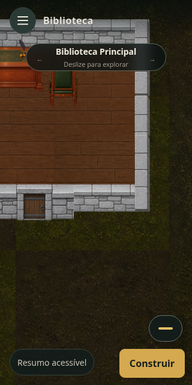          | 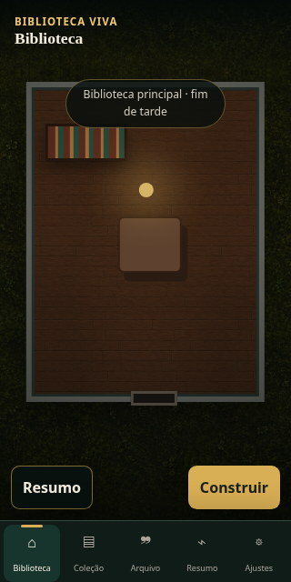          |
| Biblioteca · 360×800        | 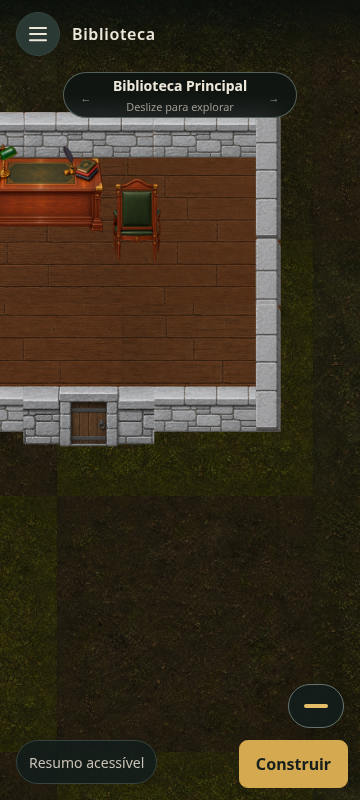          | 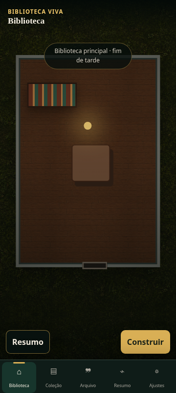          |
| Biblioteca · desktop        | 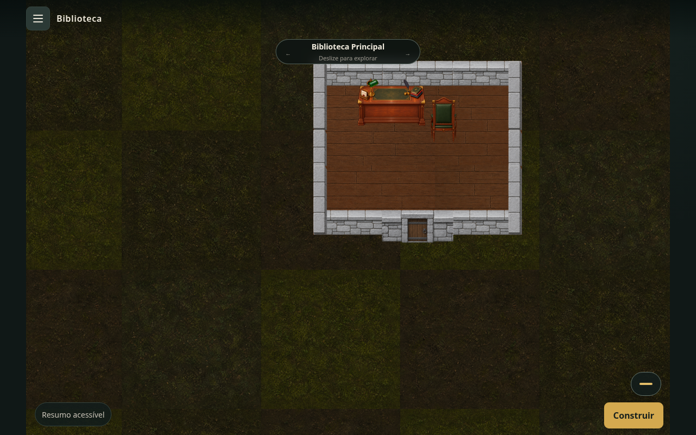 | 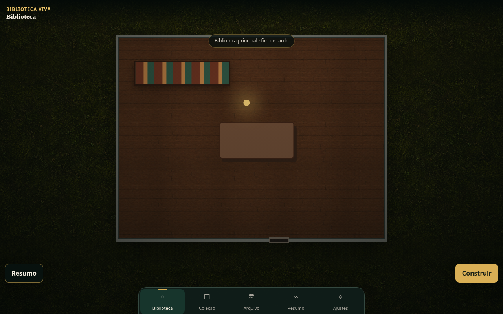 |
| Navegação móvel             | 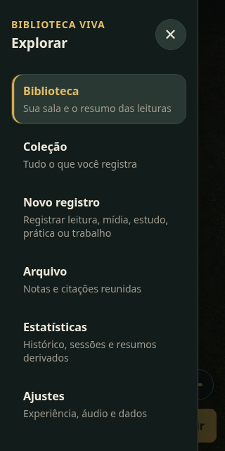            |           |
| Construção · entrada        | 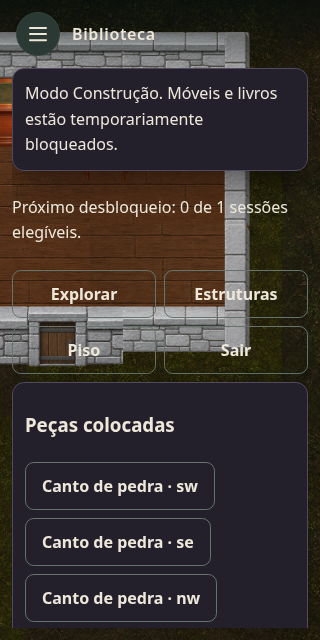     | 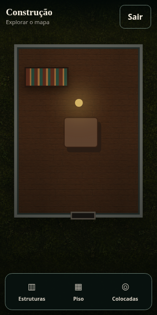     |
| Construção · palette        | 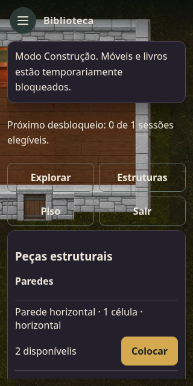        | 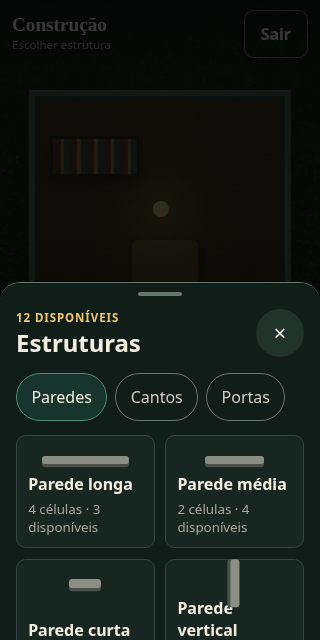        |
| Construção · seleção        | 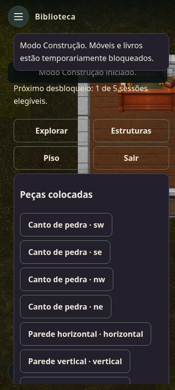      | 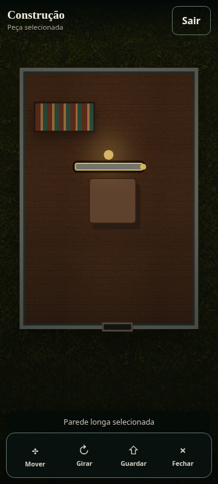      |
| Coleção · 320×640           | 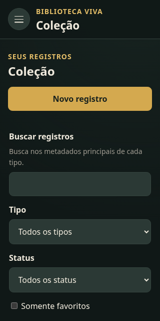          |           |
| Coleção · 360×800           | 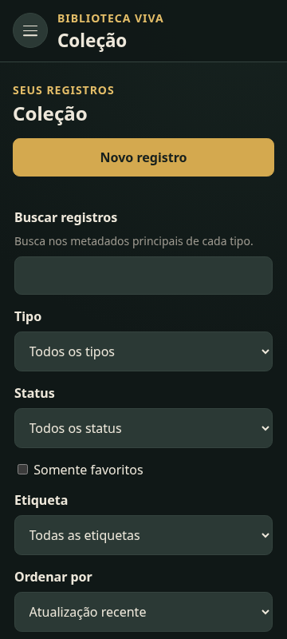          | 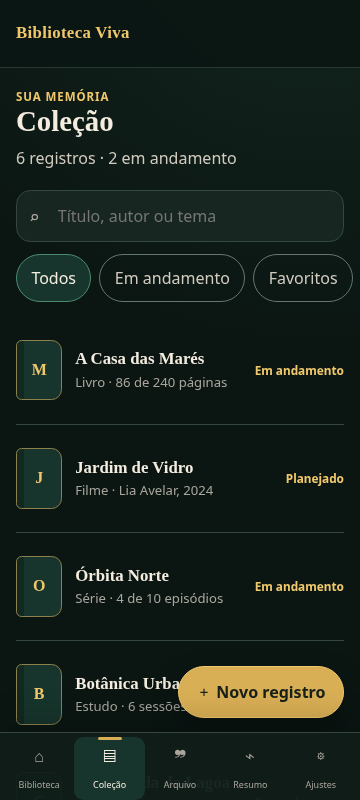          |
| Coleção · desktop           | 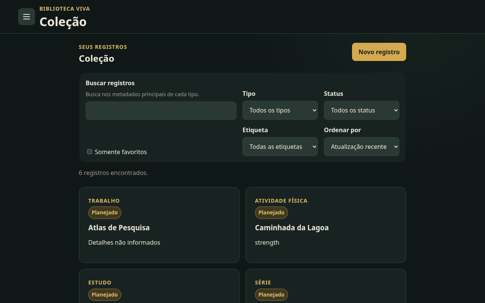 | 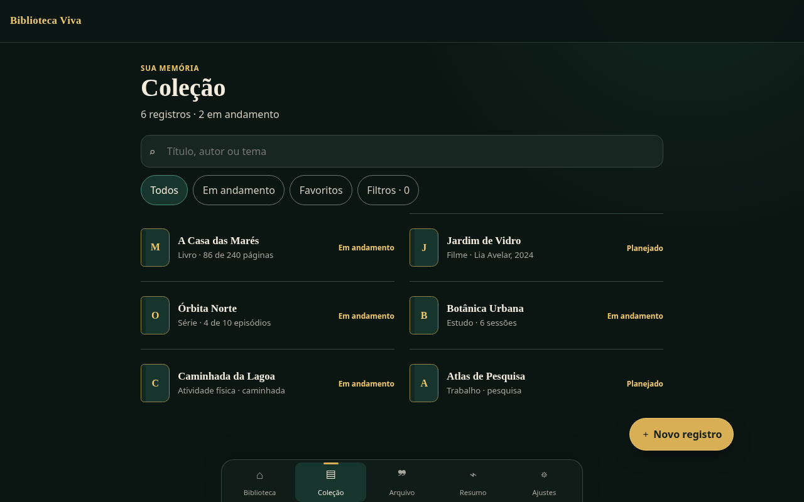 |
| Cadastro de livro · 320×640 | 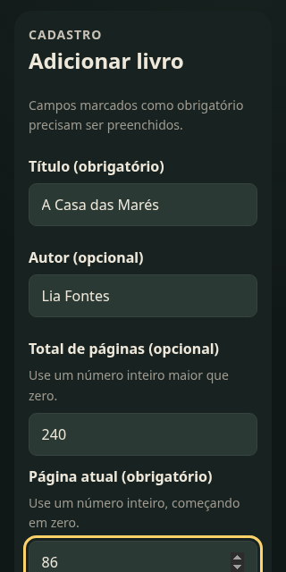                | 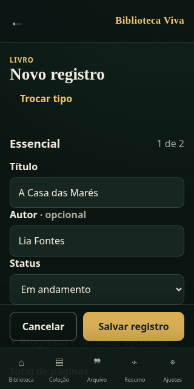                |
| Detalhe · 360×800           | 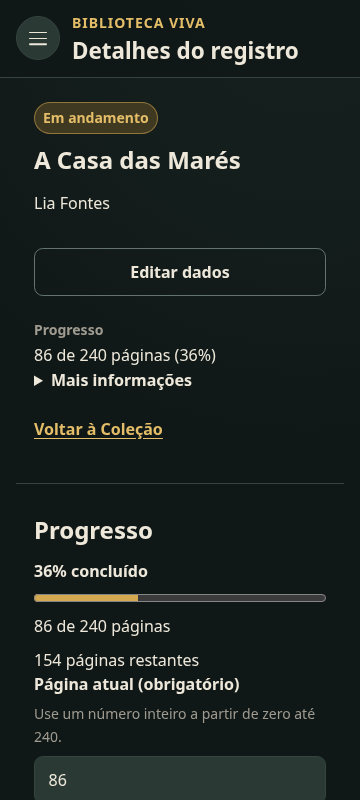                      | 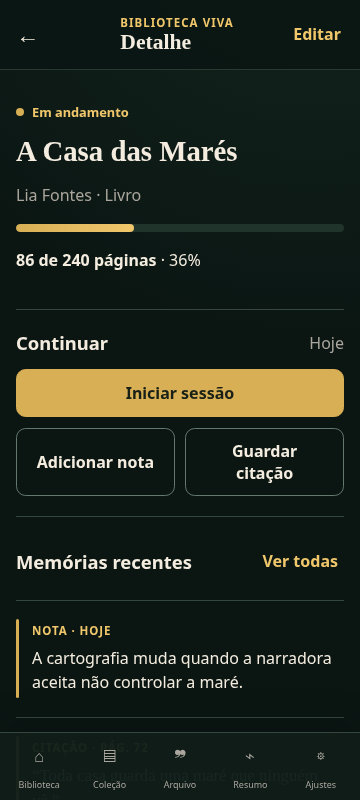                      |
| Sessão ativa · 360×800      | 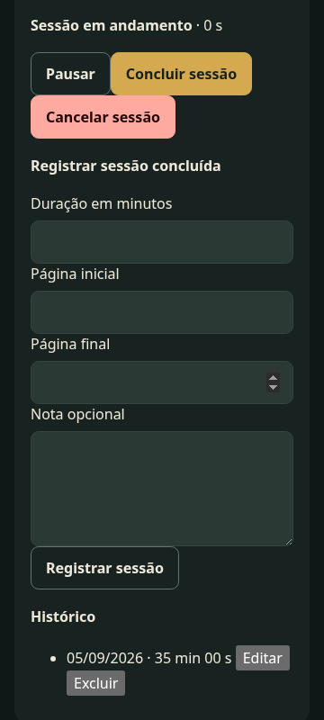               | 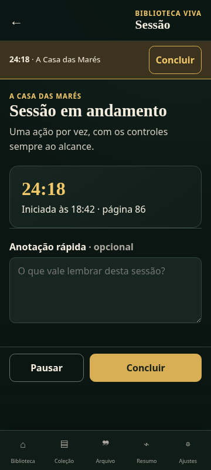               |
| Arquivo · 320×640           | 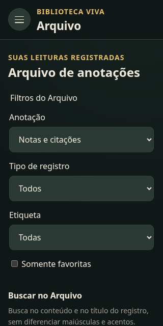                     |                      |
| Estatísticas · 360×800      | 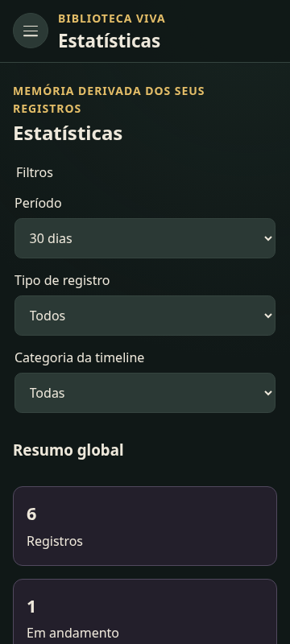            | 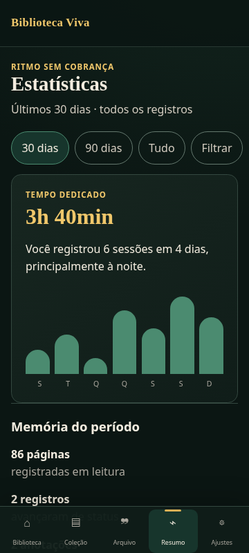            |
| Ajustes · 320×640           | 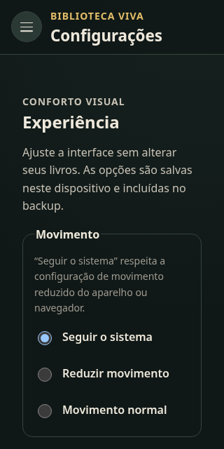                   | 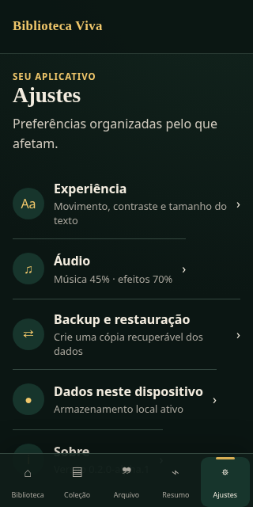                   |
| Backup · 360×800            | 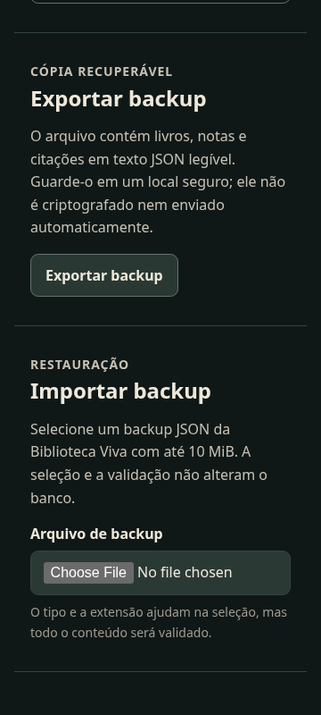                       | 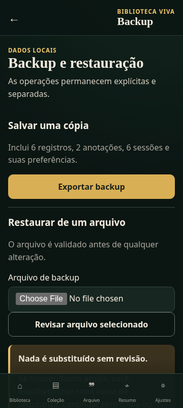                       |

## Estados adicionais da proposta

- [Carregando](captures/proposal/library-loading-320x640.png)
- [Erro recuperável](captures/proposal/library-error-320x640.png)
- [Canvas indisponível](captures/proposal/library-canvas-unavailable-320x640.png)
- [Coleção vazia](captures/proposal/collection-empty-320x640.png)
- [Seletor dos seis tipos](captures/proposal/entry-type-picker-320x640.png)
- [Construção: colocar](captures/proposal/construction-placing-360x800.png)
- [Construção: mover](captures/proposal/construction-moving-360x800.png)
- [Construção: piso](captures/proposal/construction-floor-360x800.png)
- [Construção: confirmação](captures/proposal/construction-confirm-360x800.png)

## Estados adicionais atuais

- [Biblioteca vazia](captures/current/library-empty-320x640.png)
- [Coleção vazia](captures/current/collection-empty-320x640.png)
- [Seletor atual dos seis tipos](captures/current/entry-type-picker-320x640.png)
- [Construção atual: piso](captures/current/construction-floor-360x800.png)
- [Alto contraste + texto maior: Coleção](captures/current/collection-high-contrast-text-larger-320x640.png)
- [Alto contraste + texto maior: Biblioteca](captures/current/library-high-contrast-text-larger-320x640.png)
- [Alto contraste + texto maior: Construção](captures/current/construction-high-contrast-text-larger-320x640.png)

## Implementação real de R4 — primeira entrega

Estas cinco capturas vêm do preview de produção da aplicação real depois da integração do shell. Elas ficam em `captures/implementation/`, separadas das 50 imagens da auditoria/proposta e das evidências oficiais B2:

- [Biblioteca real · desktop 1280×800](captures/implementation/library-desktop-1280x800.png);
- [Biblioteca real · 320×640](captures/implementation/library-320x640.png);
- [Biblioteca real · 360×800](captures/implementation/library-360x800.png);
- [Coleção convencional · 320×640](captures/implementation/collection-320x640.png);
- [Construção real sem dock global · 320×640](captures/implementation/construction-320x640.png).

As capturas da Biblioteca usam o canvas Phaser, a estrutura persistida, os assets e a câmera reais. A etiqueta aparece durante seu ciclo de cinco segundos; a captura de Construção comprova apenas a ausência do dock no estado inicial da tarefa, não a futura máquina completa.
